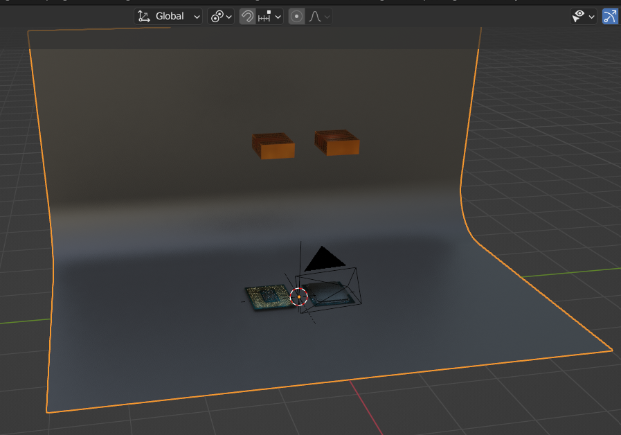
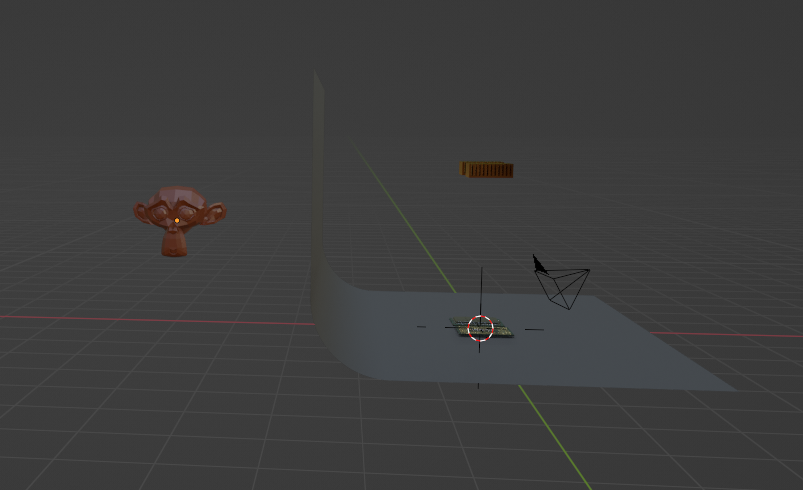
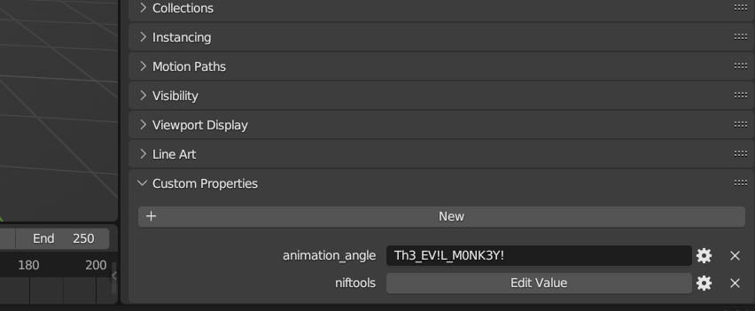

# Evil Monkey 1

## Description

One of the employees at our studio "Meatball Works" sent out this blend file to an external company for review and lighting reworks. When it came back, our EDR system captured malicious traffic that seemed to be coming from Blender. One of the SOC analysts found some sort of encrypted shellcode in the file but doesn't know the encryption key. Can you find it? 

*Flag format: PCTF{decryption_key}*

*Author: @meatball5201*

## Files

* [PCTFChallenge.zip](files/PCTFChallenge.zip)

## Solution

The provided zip file contains PCTFChallenge.blend which is a Blender 3D scene file. Opening it in Blender, we can see a scene with two computer processors.

Rotating the scene around by using the center mouse wheel, we can see that behind the backdrop there appears to be a 3D monkey head (the "evil" monkey).

Clicking on the monkey object named "Suzanne", we can open the object properties menu and scroll to the bottom where we see a custom property called "animation angle". This contains the flag string which we then just need to wrap in PCTF{} and submit.

