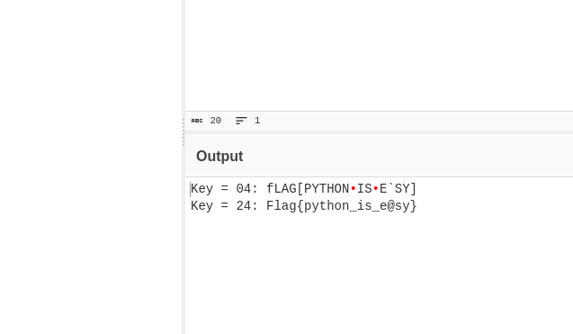

# Python XOR

## Description

The flag has been encrypted, yet again. Find a way to iterate through the alphabet variable to decrypt the flag.

*Flag format: Flag{}*

*Author: CACI*

## Files

* [XOR.py](files/XOR.py)

## Solution

The provided python file contains a string that has been obfuscated with a simple xor cipher.

```python
from string import punctuation

alphabet = list(punctuation)
data = "bHEC_T]PLKJ{MW{AdW]Y"
def main():
#   For loop goes here
    key = ('')
    decrypted = ''.join([chr(ord(x) ^ ord(key)) for x in data])
    print(decrypted)
main()
```

In order to easily reverse this, you can add a for loop to test different keys, or just drop it into cyberchef with the XOR Brute Force tool.



